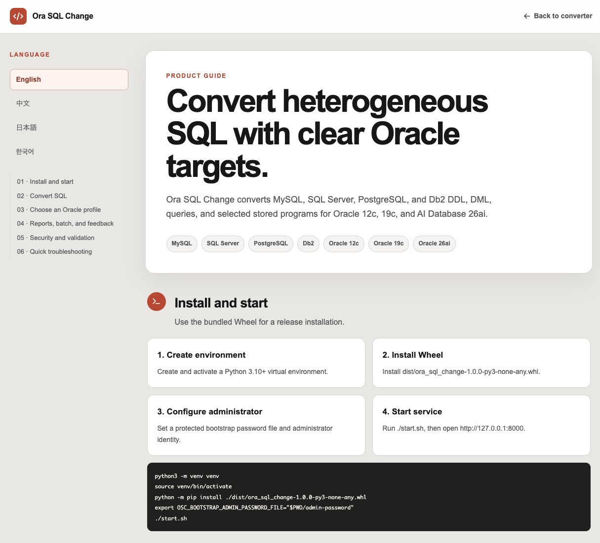

# Ora SQL Change (OSC) 1.1.0

Ora SQL Change (OSC) converts MySQL, SQL Server, PostgreSQL, and Db2 SQL into version-aware Oracle SQL for Oracle 12c, Oracle 19c, and Oracle AI Database 26ai.
by Hong Lin

## Demo
http://132.145.205.222:5173/

## OSC
Convert heterogeneous SQL with clear Oracle targets.
Ora SQL Change converts MySQL, SQL Server, PostgreSQL, and Db2 DDL, DML, queries, and selected stored programs for Oracle 12c, 19c, and AI Database 26ai.

## Help



## Capabilities

- DDL, DML, query, object, function, and selected procedural conversion.
- Explicit target profiles: `oracle_12c`, `oracle_19c`, `oracle_26ai`.
- Rule diagnostics that distinguish automatic conversion from manual review.
- Web UI, CLI, persistent batch conversion with owner/admin history deletion, localized reports, and rule feedback.
- Safe Oracle validation and explicitly confirmed disposable-schema execution.
- RBAC, audit metadata, in-memory sessions, and SQLite feedback persistence.

Converted SQL is a migration aid, not deployment approval. Validate output against representative source and Oracle environments before production use.

## Requirements

- Python 3.10 or newer.
- A single Web worker. Users and sessions are process-local in version 1.1.0.
- Optional Oracle connectivity requires an accessible non-production Oracle environment and suitable credentials.

## Install

From an extracted release ZIP, install the bundled Wheel:

```bash
python3 -m venv venv
source venv/bin/activate
python -m pip install dist/ora_sql_change-1.1.0-py3-none-any.whl
ora-sql-change --version
```

From source:

```bash
python3 -m venv venv
source venv/bin/activate
python -m pip install -r requirements.txt
python -m pip install -e .
```

## First Administrator

No weak default account is created. The recommended bootstrap method is a protected password file:

```bash
printf '%s' 'replace-with-a-strong-password' > admin-password
chmod 600 admin-password
export OSC_BOOTSTRAP_ADMIN_PASSWORD_FILE="$PWD/admin-password"
export OSC_BOOTSTRAP_ADMIN_USERNAME="admin"
export OSC_BOOTSTRAP_ADMIN_EMAIL="admin@example.com"
```

`OSC_BOOTSTRAP_ADMIN_PASSWORD` is available for controlled environments but may be exposed through process environments. Demo users are created only with `OSC_ENABLE_DEMO_USERS=1` and must never be enabled in production.

## Start

Extracted release ZIP or installed source checkout:

```bash
./start.sh
```

`start.sh` requires the bundled Wheel or source checkout to be installed first. It supports both layouts through the same `api.main:app` entry point.

Installed Wheel:

```bash
python -m uvicorn api.main:app --host 127.0.0.1 --port 8000 --workers 1
```

List the API calling methods and endpoint catalogue without starting the server:

```bash
python -m api.main -h
```

`-h`, `-help`, and `--help` are equivalent. They print startup commands, key environment variables, the `X-Session-ID` authentication model, the full endpoint list grouped by category with required permissions, common request bodies, and curl examples. Interactive OpenAPI docs are also available at `/docs` (Swagger UI) and `/redoc` once the server is running.

## CLI

The installed CLI converts files locally and can also call the REST API directly.

Local conversion:

```bash
ora-sql-change convert <INPUT_FILE> -s <mysql|sqlserver|postgresql|db2> --target-profile <oracle_12c|oracle_19c|oracle_26ai> [-o <OUTPUT_FILE>]
ora-sql-change batch <INPUT_PATH> -s <mysql|sqlserver|postgresql|db2> [-o <OUTPUT_DIR>] [-p <pattern>] [--parallel <n>] [--report <path>]
ora-sql-change analyze <SQL_FILE> -s <mysql|sqlserver|postgresql|db2>
ora-sql-change rules -s <mysql|sqlserver|postgresql|db2>
```

Call the REST API directly:

```bash
ora-sql-change api configure --server http://127.0.0.1:8000
ora-sql-change api login -u <username> -p <password>
ora-sql-change api whoami
ora-sql-change api health
ora-sql-change api convert -s <db> -q "<SQL>" [-f <file>] [-o <output>] [--target-profile <profile>] [--language <en|zh|ja|ko>]
ora-sql-change api analyze -s <db> -q "<SQL>" [-f <file>]
ora-sql-change api suggest -s <db> -q "<SQL>" [-f <file>] --provider <local|openai|claude>
ora-sql-change api batch -s <db> -i <input> [--wait] [--download <path>] [--download-format <zip|markdown>]
ora-sql-change api status <job_id>
ora-sql-change api results <job_id>
ora-sql-change api download <job_id> --download <path>
ora-sql-change api cancel <job_id>
ora-sql-change api delete <job_id>
ora-sql-change api logout
```

The `api` commands persist the server URL and authenticated session in `~/.ora-sql-change/config.json` (mode `0600`). When logged in, `api batch` submits server-side jobs and can wait for completion or download results; when no session is available, it falls back to local conversion. See `docs/osc_app_readme.md` for the full CLI reference.

Open `http://127.0.0.1:8000`. Use a TLS reverse proxy before exposing the application to a network. Do not run multiple workers in version 1.1.0.

## Configuration

| Variable | Purpose | Default |
|---|---|---|
| `OSC_HOST` | Source `start.sh` bind address | `127.0.0.1` |
| `OSC_PORT` | Source `start.sh` port | `8000` |
| `OSC_RELOAD` | Enable local development reload when set to `1` | disabled |
| `OSC_CORS_ORIGINS` | Comma-separated trusted browser origins | same-origin only |
| `OSC_DATABASE_PATH` | SQLite feedback database path | source `data/`; Wheel user data directory |
| `OSC_BOOTSTRAP_ADMIN_PASSWORD_FILE` | Protected bootstrap password file | unset |
| `OSC_BOOTSTRAP_ADMIN_PASSWORD` | Bootstrap password environment value | unset |
| `OSC_REPORT_AUTHOR` | Downloaded report author | `Hong Lin (hong.lin@oracle.com)` |
| `OSC_REPORT_ORGANIZATION` | Downloaded report organization | `Oracle SE Hub Systems` |
| `OSC_AI_CONFIG_FILE` | Path to the protected AI provider configuration | source `config/ai_providers.env` fallback |
| `OSC_OPENAI_API_KEY` | OpenAI key referenced by the sample AI config | unset |
| `OSC_CLAUDE_API_KEY` | Anthropic key referenced by the sample AI config | unset |
| `AI_SUGGESTIONS_DISABLED` | Disable all AI suggestion providers when set to `1` | disabled |

Explicitly setting either report identity variable to an empty string hides that field.

### AI SQL Conversion Suggestions

AI suggestions are manually triggered after deterministic conversion. They are advisory only and never alter, execute, cache, persist, or certify converted SQL. The legacy `enable_ai` conversion flag is accepted for compatibility but ignored.

To configure providers:

```bash
cp config/ai_providers.env.example config/ai_providers.env
chmod 600 config/ai_providers.env
export OSC_AI_CONFIG_FILE="$PWD/config/ai_providers.env"
export OSC_OPENAI_API_KEY='replace-with-provider-secret'
```

Provider keys normally come from process environment variables referenced by the protected config file. Administrators with `system:config` can edit provider enablement, models, limits, and the local loopback URL from Settings; non-secret changes are atomically written to `ai_providers.env` and take effect immediately. OpenAI and Claude URLs remain fixed official HTTPS endpoints. Settings also accepts a temporary API key that is held only in process memory, never returned or written to disk, and disappears on restart. Do not place secrets in `ai_providers.env`. SQL and diagnostics are sanitized by default. Sending original SQL requires typing `SEND_ORIGINAL_SQL` for each individual request. Every successful AI response includes one or two non-authoritative Oracle candidate SQL statements for manual comparison and copying; candidates are never applied or executed automatically. AI suggestion results remain only in page memory. The separate timestamped Markdown export intentionally includes source SQL, deterministic rule-converted SQL, and all AI candidate SQL, so protect it according to the source system’s data classification.

## Documentation

- `docs/osc_app_readme.md` — CLI and API command reference.
- `docs/CONVERSION_RULES.md` — reviewed conversion rules v1.1.0.
- `docs/CONVERSION_RULES_SIMPLE_EN.md` — simplified English conversion mapping tables.
- `/reference/conversion-rules?lang=en|zh|ja|ko` — multilingual HTML rule reference.
- `docs/ORACLE_TARGET_PROFILES.md` — Oracle 12c/19c/26ai behavior.
- `docs/ARCHITECTURE.md` — implemented architecture.
- `docs/DEPLOYMENT.md` — secure deployment, backup, and rollback.
- `docs/异构数据库到Oracle迁移测试案例汇总_v1.1.md` — migration test-case catalog.
- `docs/异构数据库Docker源端测试环境搭建指南.md` — Docker-based source databases for optional heterogeneous-to-Oracle L4 testing.
- `docs/RELEASE_CHECKLIST.md` — release verification.

## Security Notes

- Sessions and users are in memory and reset when the service restarts.
- Rule feedback is stored in SQLite; protect and back up the database as business data.
- Oracle credentials are request-scoped and must not be logged or persisted.
- The disposable-schema mode is restricted to non-production databases.
- See `SECURITY.md` for supported deployment and reporting guidance.
